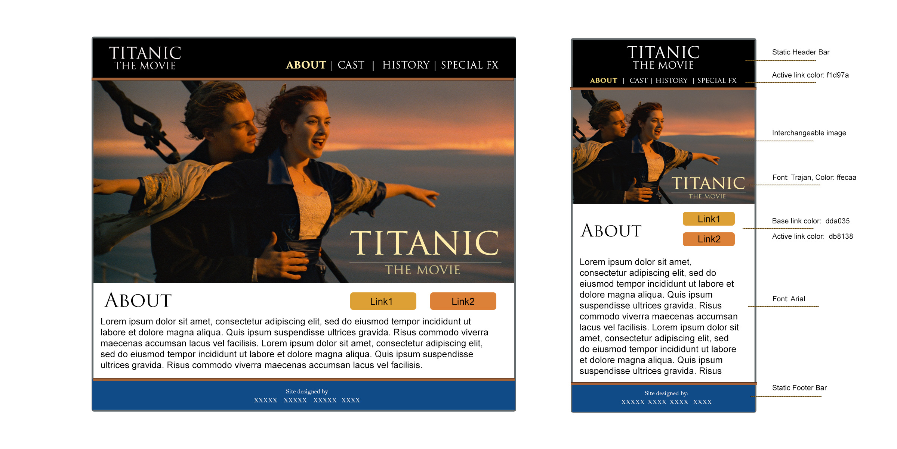
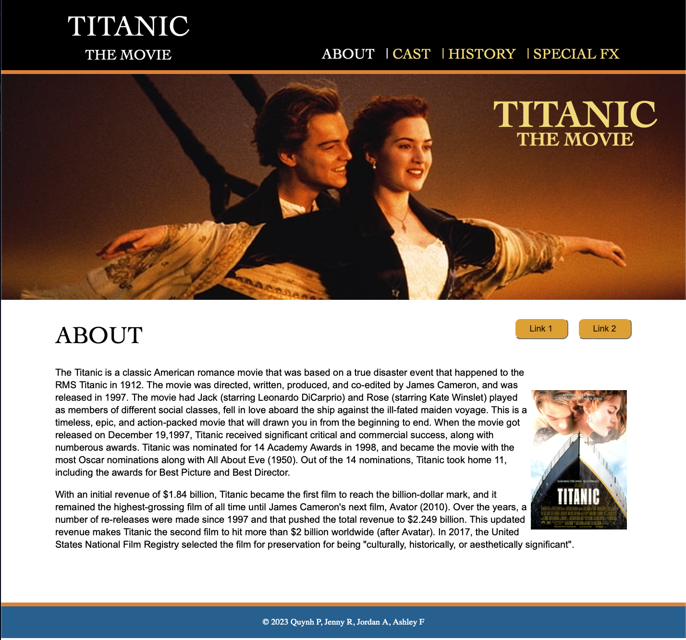

We are pleased to present this website based on the movie The Titanic. Our group communicated frequently throughout the process through zoom meetings, email, text, etc. to coordinate the develop this website. During our first meeting, we presented our wireframes (see wireframes below) to the group and then developed a final design for which we would base the website on (see final website mockup below). We replied on the specs of the mockup as a starting point to develop our own page to contribute to the website. Naturally through the process, some elements were altered, added, and/or removed through continuous collaboration and agreement. 

The website is built for SEO and accessibility across all platforms and showcase a consistent theme throughout. The header navigation links feature transitions that provide feedback to where the user has been within the site using font color changes. Additionally, the buttons and text links mixed throughout the site feature animations and transitions as well to give the user an interactive experience. All information featured on this website is borrowed from external sources and the citations are provided along with the respective contributors’ challenges feedback below. 

# Final Website Style Guide/Mockup:

# Teammate Wireframe for Inspiration:

## Quynh's wireframe:

When we had our first meeting to bring up the ideas for the layout, everyone else in the group had design background so they created theirs on Illustrator or Canva. I thought the mockup was to do a website mockup so I created a website instead. My original layout still had the title in the middle with the navigation at the bottom, follow by the content in certain width similar to our past assignments, and everyone in the group had very similar colors. What included in my original mockup was also the responsive screens CSS. We each picked something we like from the four wireframes and since I already had the starting code, the members and I decided that I would do the layout. So before Ashley created the repository for the group, I used my wireframe to create the final mockup just to avoid all the pull requests for the edits and I can use my time to make sure the website looks like the final mockup. Then, when Ashley created the repository, I moved the code that I did from the mockup to my branch - hence the similarity from my wireframe to the final mockup.

## Jenny's wireframe:

## Ashley's Wireframe:

## Jordans Wireframe:

My vision for the project was that the project would
revolve around key themes that appear in the movie. There was a lot of symbolism and imagery that appeared in the movie and I was facinated by the level of forshadowing and hindsight presented. I had thought the pages could represent an important item in the film. For instance: The Heart of The Ocean for about, etc. I ended up repurposing this for my now themes page where I look into these topics on a deeper lens. 

# Group Challenges 

## Quynh's Challenges:

While creating the layout, I found that the main challenges was finding the optimal cut off for responsive screens and making sure the website is still looking consistent with the responsive screens. I also couldn't figure out why my code wasn't updating for a while, but then I realized I forgot to merge to the main. I think some of the other minor challenges for me were adjusting the banner cover photo to a specific coordinate so that the users can see the main focus of the banner, and making sure it remains the main focus of the photo even in various browsers and responsive screens. My other minor challenge was when I created the first version of the title with subtitle underneath for the layout, the display I had created a larger line gap than I wanted, so it took some time to move it around and play with the padding and the margin. Since we learned CSS grid around the time of the project, it made creating the layout (header, nav, body, footer) a lot easier than if I were to use flex box. I think the team was productive and effective in communication. We had multiple meetings to go through the issues and we helped each other out like true teammates. 

## About Page Reference:

Titanic | The Story Lives On | Stories for Kids. (n.d.). Www.youtube.com. Retrieved April 7, 2023, from https://www.youtube.com/watch?v=H_NryL40-lw

Titanic Survivors • Titanic Facts. (2018, June 4). https://titanicfacts.net/titanic-survivors/?

Wikipedia Contributors. (2018, November 25). Titanic (1997 film). Wikipedia; Wikimedia Foundation. https://en.wikipedia.org/wiki/Titanic_(1997_film)

(2023a). Shopify.com. https://cdn.shopify.com/s/files/1/1416/8662/products/titanic_1997_original_film_art_713cc08c-5fe2-49d1-bd32-51a1d5890d43.jpg?v=1675533926

(2023b). Nocookie.net. https://static.wikia.nocookie.net/jamescameronstitanic/images/8/86/I%27mflyingscene.jpg/revision/latest?cb=20110322225905

## Jordan's Challenges:

I think the biggest challenge I had to undergo was the process of integrating my workflow and the way I coded previously for the last twelve weeks into this group project. As this is the first coding course I have ever taken in my life, this group experience was also the first time where I had to work with others in a technical capacity. Normally I wouldn’t like working with others if I don’t have a handle on the material. I am not a confident coder. I don’t believe I had remotely enough practice to say that, nor do I believe that I know everything there is to know about HTML and CSS. So when I started on the project, I was excited to collaborate but I was also slightly intimidated by the fact that three other individuals were relying on me to make an exceptional project and their grades depended on it. 

I don’t think there ever was an actual “burden.” I think this is due to Ashley's (our group lead) excellent job of delineating the schedule for the last three-four weeks. When it was time for me to start coding my page, I of course decided to take a look at the others and I was surprised at what I saw. There were some coding decisions in the website that I wouldn’t have necessarily made, there was some code that I didn’t even know existed. I found myself repeatedly going “We can do that with that?” I honestly learned more about HTML and CSS in this group than I have in the entire course just by simply working with my peers, going through trial and error, and us helping each other to craft this website. I am leaving this group in my opinion much more knowledgeable about HTML/CSS than I had prior and I am proud of the work that I have done for the group. If you must know something I am struggling with, it’s still media queries. They are not fun for me at all. Also, I struggled to combine CSS for efficiency. Every time I tried to group classes with similar written material, my page would break. I just gave up and hoped for the best. 

As for my commits, I don’t think it’s necessarily fair to take my git commit history into account when looking at me compared to my peers. I tended to work in bulk throughout the assignment. I would commit almost 5-6 hours a day towards this since I started my work on March 24th. My page (themes) has the most written content on it. As such I did plenty of research, I watched the film all over again to understand its nuances, I looked over and helped my peers wherever I could, I participated in all of our meetings where our leader made several commits based on changes I wanted to see implemented, etc. I believe that I have had an impact on the project, (not the biggest per se,) but I don’t think I was a slouch at any point during the project. No one was. This was the most communicative and productive group, I have ever been in during my entire collegiate history. If you look at the additions I have made, they show a more realistic image and show that I have added just as much code as my peers. Again not the biggest, but enough to hold my own.

## Themes Page Sources:

The Academy. (2016, May 23). Titanic. Oscars.org | Academy of Motion Picture Arts and Sciences. https://www.oscars.org/collection-highlights/titanic

Appelo, T. (2022, December 19). What you need to know about 'Titanic' on its 25th anniversary. AARP. https://www.aarp.org/entertainment/movies-for-grownups/info-2022/titanic-25th-anniversary

Encyclopedia Britannica. (n.d.). Titanic - Aftermath of Titanic sinking. https://www.britannica.com/topic/Titanic/Aftermath-and-investigation

Hunter, D. (2012, April 14). The real heart of the ocean. Scientific American Blog Network. https://blogs.scientificamerican.com/rosetta-stones/the-real-heart-of-the-ocean/

Library of Congress. (2020, October 4). Immigrants in the progressive era | Progressive era to new era, 1900-1929 | U.S. history primary source timeline | Classroom materials at the Library of Congress | Library of Congress. The Library of Congress. https://www.loc.gov/classroom-materials/united-states-history-primary-source-timeline/progressive-era-to-new-era-1900-1929/immigrants-in-progressive-era/#

Molly Brown. (2012, June 12). Aftermath of the sinking of the Titanic. Molly Brown House Museum. https://mollybrown.org/aftermath-of-the-sinking-of-the-titanic

National Oceanic and Atmospheric Administration. (2022, October 4). R.M.S Titanic - History and significance. https://www.noaa.gov/gc-international-section/rms-titanic-history-and-significance

SOLAS. (n.d.). International convention for the safety of life at sea (SOLAS), 1974. https://www.imo.org/en/About/Conventions/Pages/International-Convention-for-the-Safety-of-Life-at-Sea-(SOLAS),-1974.aspx. https://www.imo.org/en/About/Conventions/Pages/International-Convention-for-the-Safety-of-Life-at-Sea-(SOLAS),-1974.aspx

Theme and symbolic analysis of Titanic, inception and The great Gatsby. (2014, April 11). FilmAnalysisBerry. https://jlberryblog.wordpress.com/2014/04/11/theme-and-symbolic-analysis-of-titanic-inception-and-the-great-gatsby/

Vargas, A. (2020, August 15). There's actually a realistic reason for 'Titanic's specific runtime. Showbiz Cheat Sheet. https://www.cheatsheet.com/entertainment/theres-actually-a-realistic-reason-for-titanics-specific-runtime.html/

## Ashley's Challenges:

Oh, where to start! LOL. When we started this project and I learning we needed to choose a lead for the project, I was a bit timid to nominate myself for the role of "lead" knowing there would be more responsibility on my part to stay on top of pull requests as well as to make sure merges and conflicts were properly handled, knowing I had NO prior experience working on a group coding project, let alone managing it. I was worried I would let the team down, but I decided to step up to the plate knowing it would be an opportunity to push myself to learn in the real world! LOL. I have to say I couldn't be happier with the teammates I had, because we all worked as a SOLID team, and everyone stepped up to help whenever someone hit a roadblock. As a project whole, I feel I did not have any challenges when it came to relying on my team and I couldn’t be happier with the final website we created! 

With this said, when it comes to personal struggles, the first struggle I had was trying to understand git and how to merge code with conflicts. It was a bit overwhelming to try and decipher what was happening when a conflict emerged, but I figured it out through extra research, and it wasn't as bad as I had feared. I also ran into a little hurdle when learning about BEM. I did struggle a lot to wrap my brain around the PROPER syntax but again, it turned out to not be such a problem. Lastly, I did struggle with pulling down updates to my local branch. I wasn't understanding why files weren’t updating, or vice versa why my pull requests weren't showing up on git, causing me to track them down under collaborators, or commits. Not to mention, I struggled to trust my files were up to date, when there were times when they weren't even though it says they were. So, I am still working through this challenge, but I feel more experience going through the steps properly will build confidence in these areas. 

As far as my commitment and participation to the project I was team lead for the group and managed the git repository, submitted a wireframe for design consideration, created a mock-up incorporating various elements from everyone’s wireframes and group feedback during initial planning, set the production schedule, set meetings, and the design of the special fx page. 

## SPFX Page Reference:

Titanic (1997 film). (2023, April 6). Wikipedia. https://en.wikipedia.org/wiki/Titanic_(1997_film)#Production

Ebert, R. (1997, December 7). Special effects live up to hype in “Titanic” | Roger Ebert | Roger Ebert. Https://Www.rogerebert.com/. https://www.rogerebert.com/roger-ebert/special-effects-live-up-to-hype-in-titanic

Titanic stories - fxguide. (2012, April 4). Https://Www.fxguide.com/. https://www.fxguide.com/fxfeatured/titanic-stories/

Deguzman, K. (2022, May 22). VIDEO: Titanic — How James Cameron Directed a Disaster. StudioBinder. https://www.studiobinder.com/blog/the-making-of-titanic-movie/

Bachor, K. (n.d.). See Rare Behind-The-Scenes Photos From “Titanic.” BuzzFeed News. Retrieved April 7, 2023, from https://www.buzzfeednews.com/article/kennethbachor/titanic-behind-the-scenes-photos

Cima, M. (2018, March 28). 17 Wild Behind-The-Scenes Secrets From Titanic. ScreenRant. https://screenrant.com/titanic-behind-scenes-trivia-facts/

## Jenny's Challenges:

I feel that I've come a long way with understanding CSS and HTML through creating this project. Before starting the project, I was nervous to code "from scratch" using a created mockup, rather than relying on lecture videos and class mockups. In regard to my webpage (cast), I struggled with applying CSS grid at first because I was incorrectly inputting the dimensions of the grid. I also struggled with the conflicting changes across our CSS because at times, I would code over a line someone else was working on simultaneously, and it would display a conflict. I am working on this and trying to be very detail-oriented in the future. During the project, I would work in sessions over days at a time before pushing my commits. I think that if I pushed my code to GitHub more often, I would have had less of a struggle to understand which version is the most updated code. 

I would consider my group to be very productive and communicative with one another. We let each other know as we were making changes, offered constructive criticism and helped one another when needed. I knew I could count on them, especially given that I was nervous that I would know the least about coding going into it. They really have helped me understand some concepts that I struggled with previously. We used a rough outline of my mockup to inspire our page layout, and I feel proud of our design choices and stylizing! I must recognize Ashley's work with dealing with the repo and merging conflicts, since that was a roadblock we encountered a few times while collaborating on our shared CSS. All in all, I think my teammates did a great job, and I enjoyed the challenge of creating this site.

## Cast Sources:
Pearl, D. (2022, December 20). The cast of Titanic: Where are they now? Peoplemag. Retrieved April 8, 2023, from https://people.com/movies/titanic-where-are-they-now/  

McPherson, C. (2023, February 12). 'Titanic's 25th anniversary re-release sets sail with $22.3 million at the Global Box Office. Collider. Retrieved April 8, 2023, from https://collider.com/titanic-re-release-box-office-22-million/  
